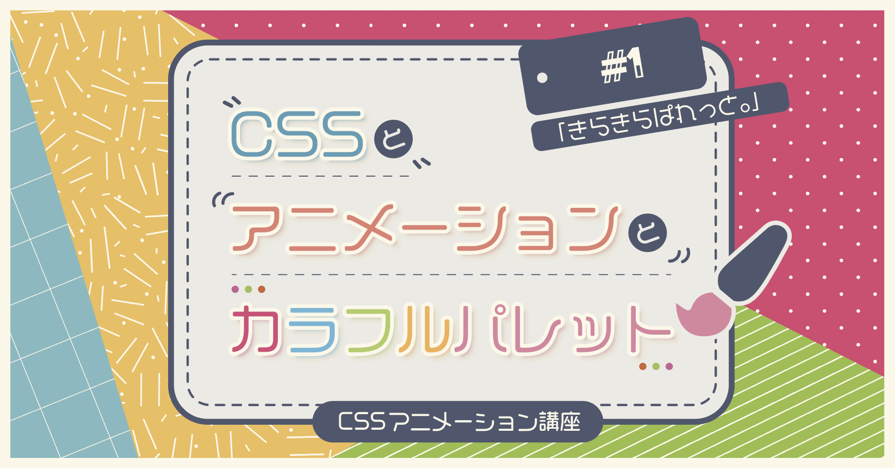
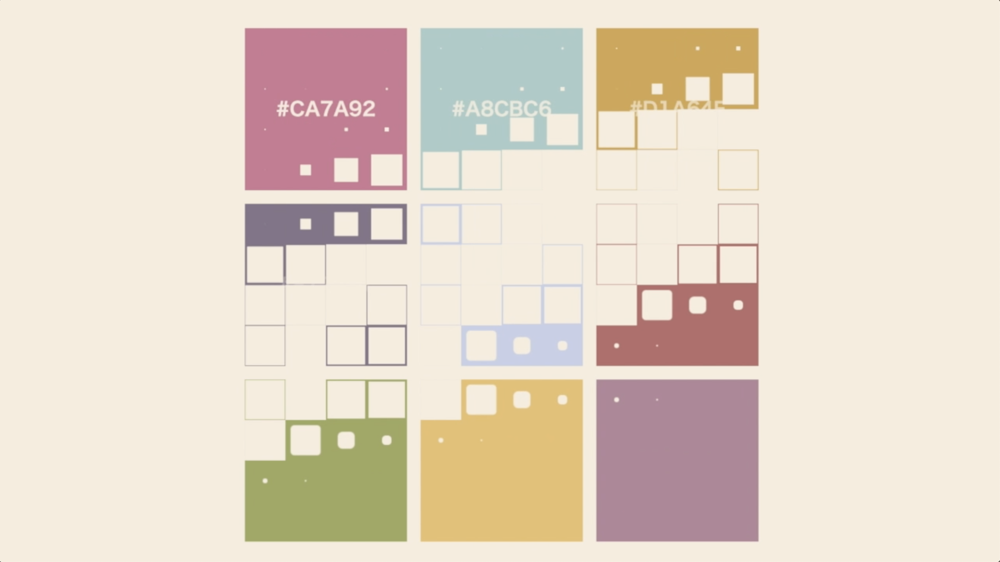

# きらきらぱれっと。



※こちらは完成品のコードになります。

## 各種コマンド
余計なパッケージを入れずにシンプルな構成に敢えてしています。
`pug`, `node-sass`, `http-server`の３つ以外のパッケージは使っていません。

#### pugのビルド

```bash
$ npm run pug
```

#### pugのビルドウォッチ

```bash
$ npm run pug:watch
```

#### scssのビルド

```bash
$ npm run scss
```

#### scssのビルドウォッチ

```bash
$ npm run scss:watch
```

#### ローカルサーバーの起動

```bash
$ npm run serve
```
