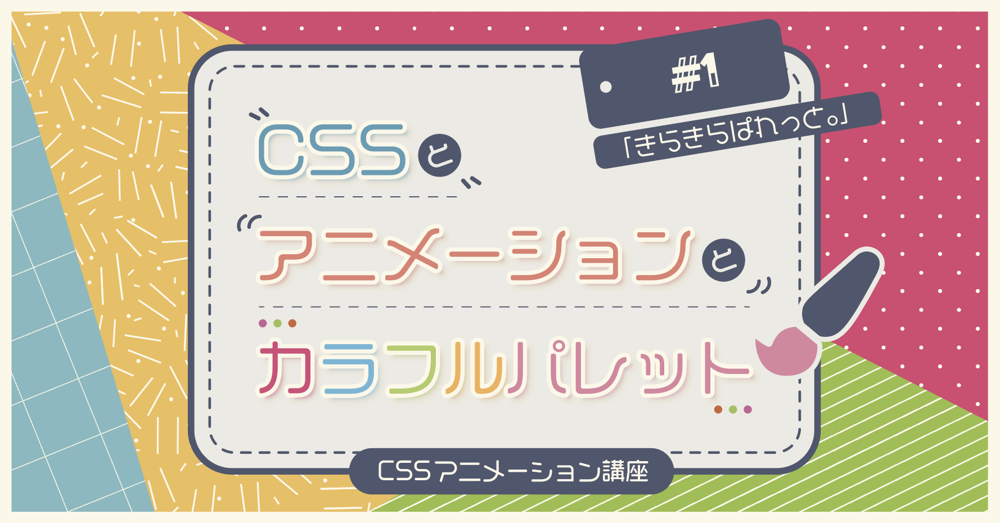
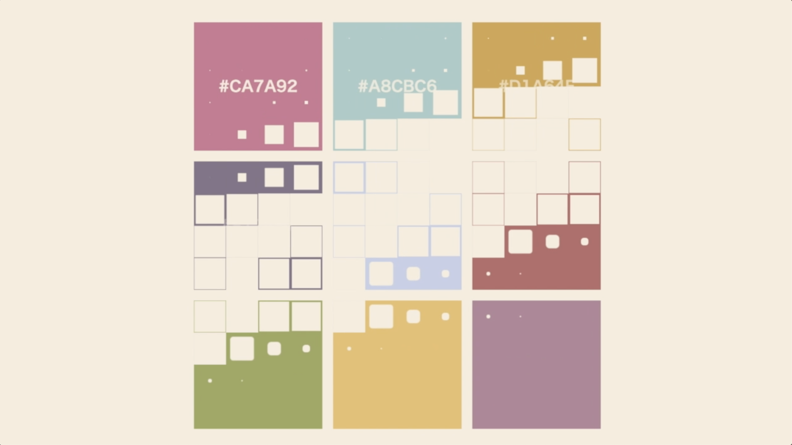

# きらきらぱれっと。



- 完成品URL
  - [http://c-toto.magical-girl.site/kirakira-palette/complete/](http://c-toto.magical-girl.site/kirakira-palette/complete/)
- 動画
  - [動作確認：Twitter](https://twitter.com/yui540/status/1127940429599604736)
- ブログ
  - []()

※こちらは受講用の未完成のコードになります。

## 各種コマンド
余計なパッケージを入れずにシンプルな構成に敢えてしています。
`pug`, `node-sass`, `http-server`の３つ以外のパッケージは使っていません。

#### pugのビルド

```bash
$ npm run pug
```

#### pugのビルドウォッチ

```bash
$ npm run pug:watch
```

#### scssのビルド

```bash
$ npm run scss
```

#### scssのビルドウォッチ

```bash
$ npm run scss:watch
```

#### ローカルサーバーの起動

```bash
$ npm run serve
```
